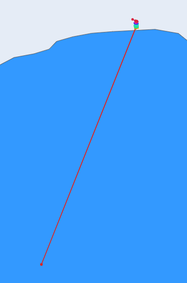
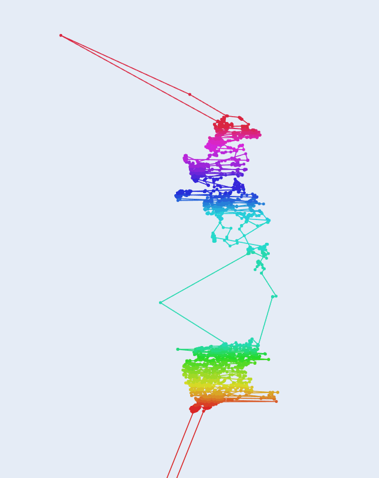
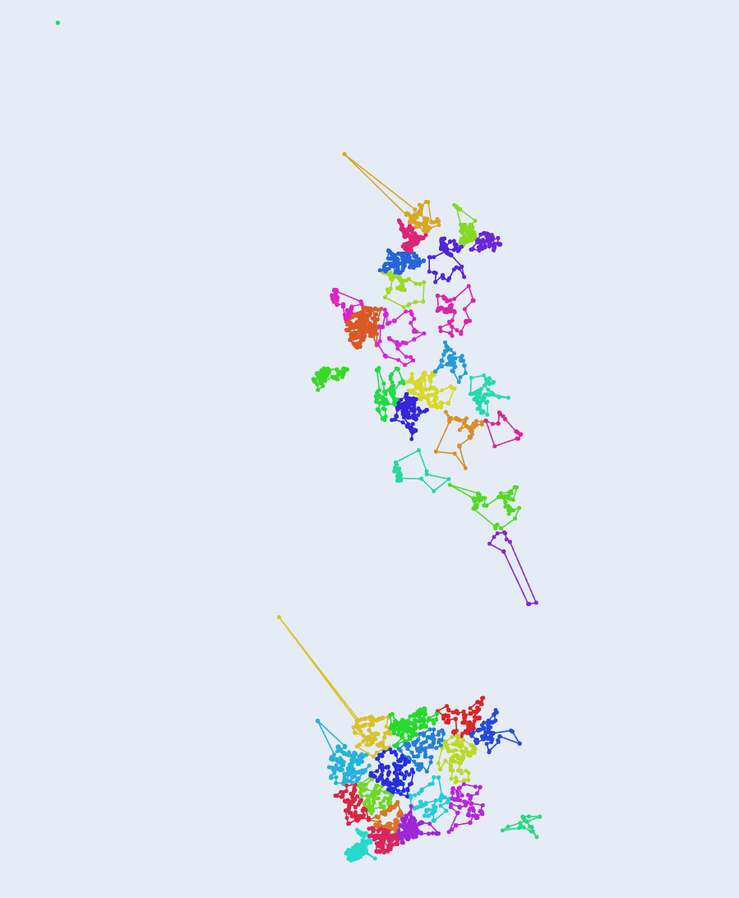

Assignment Summary
This project solves a multi-agent Traveling Salesman Problem (TSP) using two approaches: a simple geographic heuristic and a KMeans-based method with local route optimization.

Personal Path
- I first tried a heuristic that splits points by latitude so each agent gets a slice of the map.
- After seeing the routes, I noticed agents sometimes got awkward mixes of close and far points.
- To fix that, I moved to clustering the points first so each agent gets a compact group. This reduced total distance and made the routes look more balanced.

Approach 1: Heuristic (optimization.py)
- Goal: Split the map quickly without learning any patterns.
- Step 1: Sort all locations by latitude (top to bottom). This lines up points vertically so nearby north-south points are close in the list.
- Step 2: Cut the sorted list into equal slices. Each slice becomes one agent’s territory, which looks like horizontal bands across the map.
- Step 3: Inside each band, build a tour using nearest-neighbor. Start at the first point, then always move to the closest unvisited point until all are visited, then close the loop back to the start.
- Why it works: Fast and deterministic. It gives every agent a share of points and keeps them roughly in parallel north-south zones.
- Where it struggles: It ignores real clusters. If many points are packed near a band edge, routes can stretch or cross more than needed because the split is forced by latitude, not by true proximity.

     

**Issue with Heuristic Approach**: In the visualization above, notice that we have outlier points that should be treated separately. Instead, one agent is forced to travel unnecessary extra distance compared to others because the latitude-based split puts distant points in the same band. This creates unbalanced workloads where some agents have compact routes while others travel much farther.

Approach 2: KMeans + 2-opt (ML_optimized.py)
- Goal: Give each agent a tight cluster and then clean up the route inside that cluster.
- Step 1: Run KMeans with k = number of agents. KMeans repeatedly pulls cluster centers toward the points and assigns each point to its nearest center. After a few iterations, we get natural clusters—one per agent.
- Step 2: Pick the start point for each agent as the point closest to that agent’s cluster center. This puts the start near the “middle” of the cluster so the first moves are short.
- Step 3: Build an initial tour inside the cluster with nearest-neighbor. This gives a quick baseline path without heavy computation.
- Step 4: Improve the tour with 2-opt. Look at pairs of edges; if swapping the path between them makes the tour shorter (removing a crisscross), perform the swap. Repeat until no fast win remains or a small time limit is hit. This removes zig-zags and shortens the loop.
- Why it works: Clustering first keeps agents local, reducing long jumps. Starting near the center avoids bad first hops. 2-opt cleans obvious detours that nearest-neighbor leaves behind. Together this usually produces shorter total distance and less overlap between agents.
- Trade-offs: Slightly more computation than the heuristic. KMeans has randomness, but we fix the seed so results repeat.

   

**How KMeans Solves the Outlier Problem**: In the visualization above, notice how KMeans clustering handles outliers intelligently. Each agent is assigned to a natural cluster based on proximity, not artificial latitude bands. Outlier points are grouped with their closest neighbors, so agents are assigned accordingly and travel minimum distance. This creates balanced workloads where each agent covers a compact area without unnecessary long trips.

Why the KMeans approach is better
- Clustering keeps each agent in a tight area, cutting long cross-map hops.
- Center-based starts avoid bad initial choices.
- 2-opt removes obvious detours that nearest-neighbor alone misses.
- Overall you get shorter total distance and cleaner, less overlapping routes compared to the latitude-only split.


Notes on visualization
- Both scripts use Plotly maps with zoom and pan. Each agent has its own color for clarity.


## Installation and Running Instructions

### Using `uv` (recommended)
1. Install `uv` if you haven't already: https://docs.astral.sh/uv/getting-started/
2. Clone or navigate to the project directory
3. Run the assignment:
    ```bash
    uv run optimization.py
    uv run ML_optimized.py
    ```
    `uv` will automatically handle dependencies from `pyproject.toml`

### Using pip
1. Create a virtual environment (optional but recommended):
    ```bash
    python -m venv venv
    source venv/bin/activate
    ```
2. Install dependencies:
    ```bash
    pip install -r requirements.txt
    ```
3. Run the assignment:
    ```bash
    python optimization.py
    python ML_optimized.py
    ```
